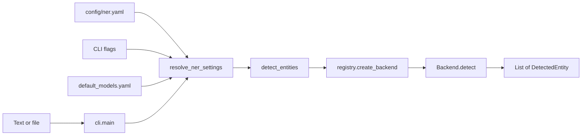

# Architecture

`ner-detector` is a **library + CLI** (not a server). Text goes in; a list of `DetectedEntity` spans comes out. Backends are selected at runtime and cached by `(backend, model_id, …)`.

## Backend families

| Family | Backends | Role |
|--------|----------|------|
| **Deterministic** | `pattern` | Regex rules; no ML, no API |
| **ML** | `transformers`, `gliner` | Local Hugging Face models; score + threshold |
| **LLM** | `llm` | Chat completion (OpenRouter or `mock`); JSON entity list |

All families implement the same `detect(text, labels, threshold) → list[DetectedEntity]` contract.

## Flow

## Settings resolution

| Source | Provides |
|--------|----------|
| `config/ner.yaml` | `backend`, `model_id`, `threshold`, `labels`, `label_preset`, `provider`, `temperature`, `max_chars` |
| CLI (`--backend`, `--model`, …) | Overrides profile fields |
| `config/default_models.yaml` | Default `model_id` per backend; `label_presets` for GLiNER/LLM |

`resolve_ner_settings()` in `ner_detector.config` performs the merge. See [configuration.md](configuration.md).

## Backends

| Backend | Module | Labels | Dependencies |
|---------|--------|--------|----------------|
| `pattern` | `backends/pattern.py` | Fixed regex types (`person`, `year`, `arxiv_id`, …) | core only |
| `transformers` | `backends/transformers_backend.py` | Model head (e.g. PER/ORG/LOC/MISC) | `--extra ml` |
| `gliner` | `backends/gliner_backend.py` | User-supplied strings (zero-shot) | `--extra gliner` |
| `llm` | `backends/llm_backend.py` | User-supplied strings (prompt) | `--extra llm`; `OPENROUTER_API_KEY` for live runs |

Long inputs for `transformers` and `llm` are chunked (default 8000 chars for LLM, 4000 for transformers, 200 overlap). If `overlap >= max_chars`, the chunker advances by `end` to avoid stalling.

LLM flow: build JSON prompt → provider (`mock` or `openrouter`) → parse `entities[]` → align spans in source text.

## Registry

`registry.create_backend()` uses a small builder map (`pattern`, `transformers`, `gliner`, `llm`). LLM instances are cached by `(backend, model_id, provider, temperature, max_chars)`.

## Entry points

- `uv run python run.py` — same as `ner-detect` console script (`pyproject.toml` → `ner_detector.cli:main`)
- `python -m ner_detector.cli`

Config path: `--config` / `-c`, or env `NER_CONFIG_PATH` (default `./config/ner.yaml`).
